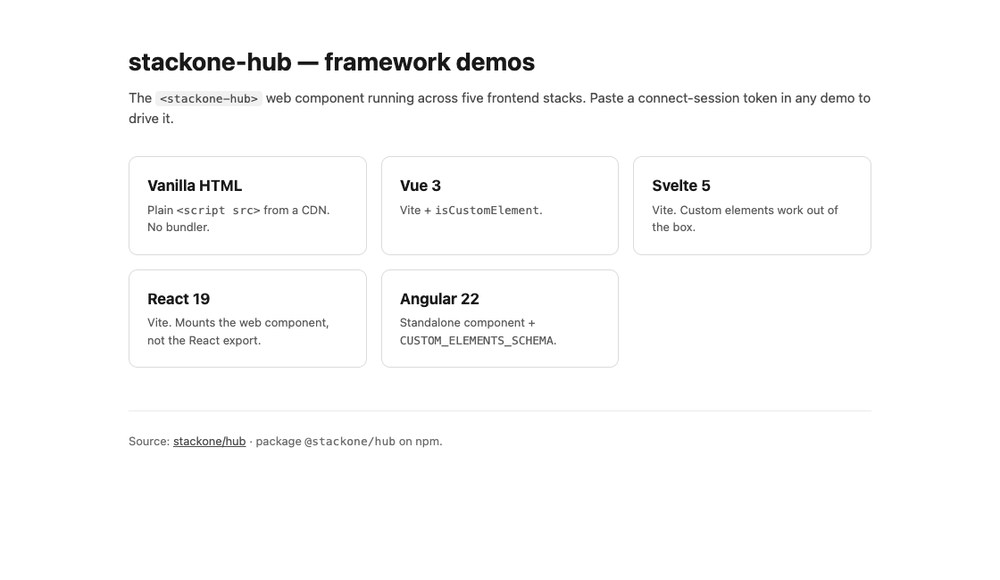
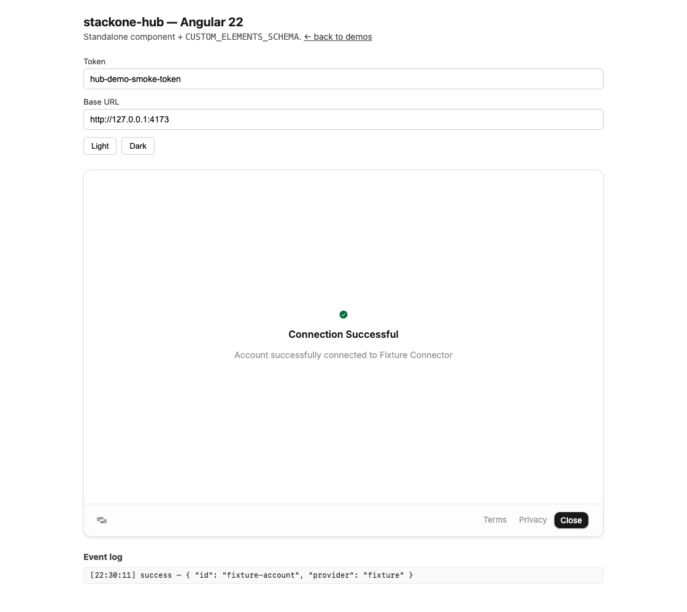

# stackone-hub-demos

Public showcase of `@stackone/hub` mounted as a web component across five frontend stacks. Single Vercel deployment, one URL per demo under path-based routing.

| Stack | Path | Notes |
|---|---|---|
| Vanilla HTML | `/vanilla/` | Loads `webcomponent.js` from unpkg, no build |
| Vue 3 | `/vue/` | Vite, `isCustomElement` |
| Svelte 5 | `/svelte/` | Vite, no config needed |
| React 19 | `/react/` | Vite, uses the web component (not the React export) |
| Angular 22 | `/angular/` | Standalone component + `CUSTOM_ELEMENTS_SCHEMA` |

All five consume `@stackone/hub` from npm — there is no `file:../..` link to a local hub checkout.

<details>
<summary>Preview the demos</summary>

Captured from the local build with Hub 1.11.4. The Angular connection uses the synthetic browser-test fixture, with no real credentials or provider account.





</details>

## Token flow

Paste-only. Mint a connect-session token out of band (curl / Postman / server-side) and paste it into the input on the demo page. The token is persisted to `localStorage` under `stackone-hub-token`. There is no in-browser auto-fetch — `POST /connect_sessions` only works against `localhost`, which a public deploy can't satisfy.

## Requirements

Use Node.js 24.21.0 (`nvm use`) and npm 12.2.0. Install the matching npm version with `npm install --global npm@12.2.0`.

## Develop a single demo

Each demo subfolder is its own self-contained project. Pick one:

```bash
cd vue && npm ci --include=dev && npm run dev      # http://localhost:5173/vue/
cd svelte && npm ci --include=dev && npm run dev   # http://localhost:5173/svelte/
cd react && npm ci --include=dev && npm run dev    # http://localhost:5173/react/
cd angular && npm ci --include=dev && npm start    # http://localhost:4200/angular/
cd vanilla && npx serve .                 # http://localhost:3000/
```

## Build everything (what Vercel runs)

From the repo root:

```bash
npm ci --include=dev
npm run build
```

This invokes `scripts/build-all.mjs`, which:

1. For each Vite/Angular demo: `npm ci --include=dev && npm run build` inside that folder.
2. Copies each demo's build output into `dist/<name>/`.
3. Copies the landing `index.html` into `dist/index.html`.

The final `dist/` is what Vercel serves.

## Verify the demos

Install the test browsers and run the browser suite:

```bash
npx playwright install
npm test
```

`npm test` rebuilds every demo before running the browser checks. Installs explicitly include build tools even when `NODE_ENV=production`.

The suite exercises each built demo in Chromium, Firefox, and WebKit: empty and rejected tokens, theme changes, persisted inputs, API-key connections, OAuth completion and cancellation, and success/close events. It loads the real Hub package with a synthetic API and refuses unexpected external requests. The vanilla CDN request uses the installed package bytes during tests; no real credentials or provider accounts are used. Live provider authentication needs a separate check with a disposable connect-session token.

React and Vue builds include typechecking. Svelte runs `svelte-check`, and Angular checks templates during compilation. Vue, Svelte, and Angular use TypeScript 6 because their current tooling needs its JavaScript compiler API; React uses TypeScript 7.

Pull requests run the same build and browser checks in GitHub Actions. `npm ci` preserves the committed dependency versions in each independent demo.

## Deploy to Vercel

1. Push this repo to GitHub.
2. Vercel → Add New Project → import the repo.
3. Accept the defaults — `vercel.json` already declares everything (build command, output directory, install command).
4. Click Deploy.

Output URL shape:

```
https://<your-project>.vercel.app/
https://<your-project>.vercel.app/vanilla/
https://<your-project>.vercel.app/vue/
https://<your-project>.vercel.app/svelte/
https://<your-project>.vercel.app/react/
https://<your-project>.vercel.app/angular/
```

## Bumping the hub version

The published-package pin lives in each demo's `package.json` (and in `vanilla/index.html` as a CDN URL). To upgrade across the board:

```bash
# Vite/Angular demos
for d in vue svelte react angular; do
  (cd "$d" && npm install --save-exact @stackone/hub@latest)
done

# Vanilla: pin the unpkg URL to the same exact version in vanilla/index.html
```

Run the build and browser checks, then commit the manifests and lockfiles together. Vercel uses Node 24 and installs npm 12.2.0 before its locked install.
